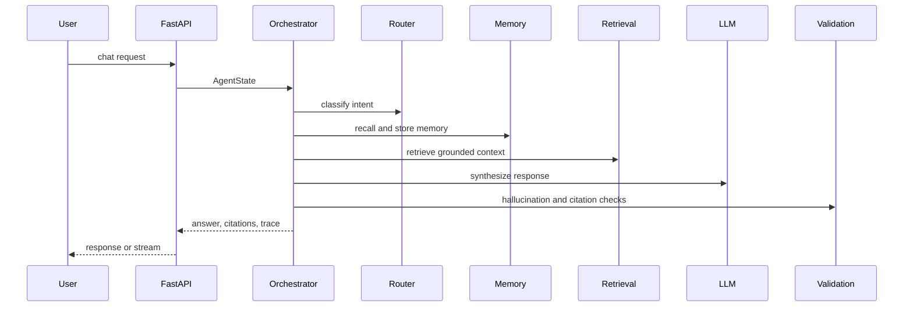

# Architecture

OmniMind is organized around a modular API gateway and a stateful agent orchestration layer.

## Services

- API Gateway: FastAPI entrypoint, auth, rate limits, CORS, OpenAPI.
- Authentication Service: JWT-first, OAuth-ready boundaries, RBAC dependencies.
- Agent Orchestrator: Sequential specialist pipeline today, LangGraph-ready state graph next.
- RAG Service: Document extraction, chunking, vector indexing, semantic search, citation payloads.
- Memory Service: Short-term runtime store now, PostgreSQL-backed episodic and semantic memory next.
- Tool Layer: Registry pattern for enterprise tools with audit-friendly execution boundaries.
- Workflow Engine: Task planning, tool execution, retries, and human-in-the-loop extension points.
- Streaming Layer: SSE and WebSocket routes for token and agent-event streaming.
- Observability: Structlog, OpenTelemetry instrumentation, LangSmith-ready environment.

## Agent Flow

## Data Model

Core tables are modeled in `apps/api/app/models/entities.py`:

- `workspaces`
- `users`
- `documents`
- `memory_records`
- `audit_logs`

The first implementation keeps memory and document metadata lightweight while the RAG payload is stored in Qdrant. The schema is designed to graduate to Alembic migrations and tenant-isolated persistence.

